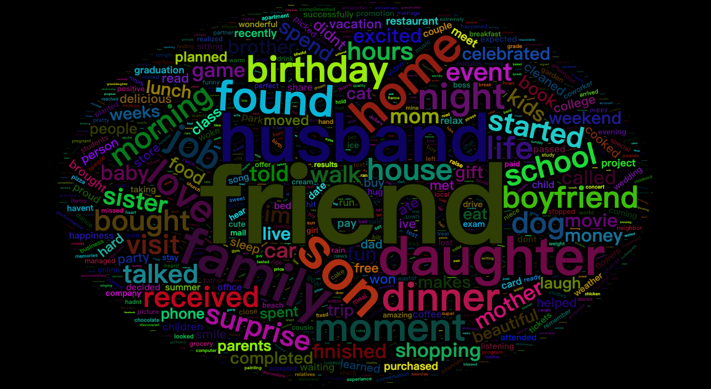

# Applied Data Science @ Columbia
## Spring 2019
## Project 1: What made you happy today?


### Tittle: Men and Women: What Makes You Feel Happy?
### [Project Description](doc/Proj1_desc.md)

This project is tented to analyze the difference between men and women in their happy moments of life and trying to use multiple ways to discover interesting facts. 

### Data
```
Happy moment text and demo data from HappyDB
https://github.com/rit-public/HappyDB
```

### Programming Language
#### [code](./source.Rmd)
```
R with packages: "tm", "ggplot2", "tidyverse", "tidytext",
                  "wordcloud2","topicmodels", "factoextra", 
                  "DT", "htmlwidgets", "kableExtra"
```

### [Report](output/report.nb.html)

***
> Following [suggestions](http://nicercode.github.io/blog/2013-04-05-projects/) by [RICH FITZJOHN](http://nicercode.github.io/about/#Team) (@richfitz). This folder is orgarnized as follows.