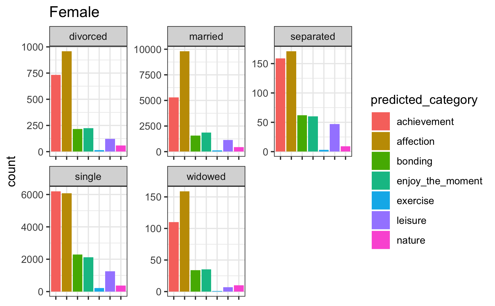
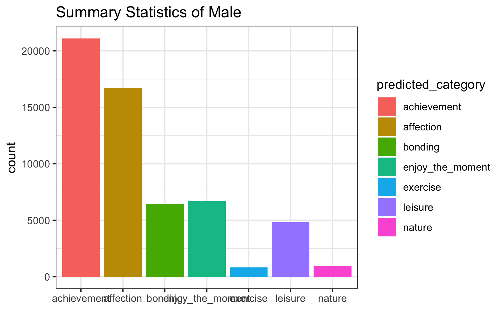
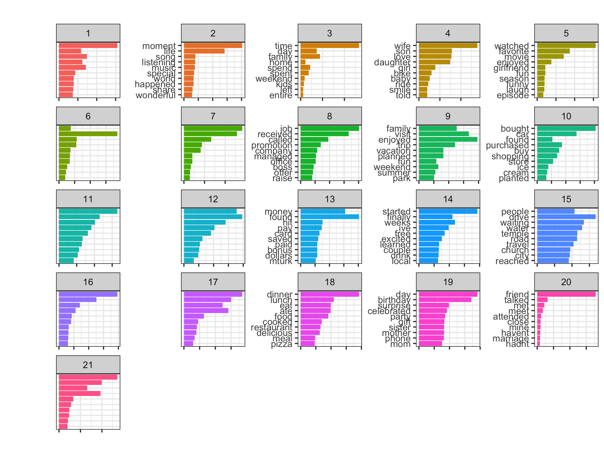

# Applied Data Science @ Columbia
## Spring 2019
## Project 1: What made you happy today?

## Project 1: Men and Women: What makes them feel happy?

### [Project Description](doc/Proj1_desc.md)
### What is our data look like ?
The data we used in the project is from Happy DB, which contains more than 100,000 happy moments text data. Here is a brief summary of our dataset. 
+ [insert plot]

### Why women and men are feeling happy?
+ [insert plot]

### What words do women and men use to describe their happy moment?
From the word cloud of female 

wordcloud of male

### What are topics for women and men in different marital status?

### Women and men, are they really that much different?

Following [suggestions](http://nicercode.github.io/blog/2013-04-05-projects/) by [RICH FITZJOHN](http://nicercode.github.io/about/#Team) (@richfitz). This folder is orgarnized as follows.

