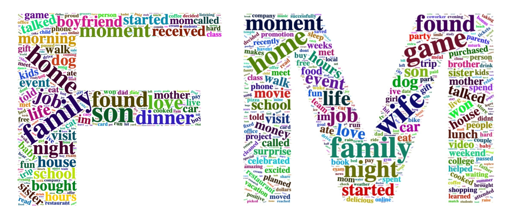

```{r warning=FALSE, echo= FALSE, error=FALSE}
packages.used = c("tm", "ggplot2", "tidyverse", "tidytext",
                  "wordcloud2","topicmodels", "factoextra", 
                  "DT", "htmlwidgets", "kableExtra")
packages.needed = setdiff(packages.used, 
                          intersect(installed.packages()[,1],
                                    package.used))
if(length(package.needed)>0){
  install.packages(packages.needed, dependencies = TRUE,
                   repos='http://cran.us.r-project.org')
}
```

```{r echo=FALSE, warning=FALSE}
print(R.version)
```

```{r warning=FALSE, echo=FALSE}
library(DT)
library(shiny)
library(tidyverse)
library(tidytext)
library(ggplot2)
library(tm)
library(wordcloud2)
library(topicmodels)
library(factoextra)
library(htmlwidgets)
library(kableExtra)
```

## What does our data look like?

The data I used in the project is from [Happy DB](https://rit-public.github.io/HappyDB/), which contains more than 100,000 happy moments text data. Here is a brief summary of our dataset. In addition to the text data, it is also possible also get many useful information such as gender, marital status, reflection period and more. In this project, I will mainly focus on the same points and differences of happy moments of different gender.
The chart below is a small piece of our dataset after reordering columns.
```{r warning = FALSE, echo=FALSE}
setwd("~/Git/Spring2019-Proj1-wangtch5")

hm_data <- read_csv("output/processed_moments.csv")

urlfile <- 'https://raw.githubusercontent.com/rit-public/HappyDB/master/happydb/data/demographic.csv'
dem_data <- read_csv(urlfile)

new_hm_data <- merge(dem_data, hm_data, by = "wid", all = FALSE)
new_hm_data <- unique(new_hm_data)
new_hm_data <- new_hm_data[c(1,7,15,2,3,4,5,6,8,9,10,11,12,13,14,16)] %>%
  filter(!(gender=="o"))

datatable(head(new_hm_data),options = list(
  autoWidth = TRUE,
  columnDefs = list(list(width = '100px', targets = c(1, 3)))
))

```
This is a brief statistics report of the data I am trying to manipulate with. The number of male is more than female, and among different marital status, the two dominate classes are married and single.
```{r, echo=FALSE}
kable(addmargins(table(new_hm_data$gender, new_hm_data$marital)), "html") %>%
  kable_styling()
```

```{r, warning=FALSE, echo=FALSE}
f_data <- new_hm_data[new_hm_data$gender == "f",] %>% drop_na(predicted_category)
m_data <- new_hm_data[new_hm_data$gender == "m",] %>% drop_na(predicted_category)

f_data <- drop_na(f_data, marital)
m_data <- drop_na(m_data, marital)

write_csv(f_data, "output/f_data.csv")
write_csv(m_data, "output/m_data.csv")
```

## Why women and men are feeling happy?

According to the barplots, women are more likely to feel happy about things related to affection and men are more willing to cheer their achievements.
```{r female,warning=FALSE,echo=FALSE,fig.width = 4, fig.height = 2}
### plot and save plots of male and feamle on marital status
ggplot(new_hm_data)+
  geom_bar(aes(x = predicted_category, fill = predicted_category)) + 
  labs(title = "Summary of Predicted Catagories") +
  facet_wrap(~gender, scales = "free") +
  xlab(label = NULL)+
  theme_bw()+
  theme(axis.text.x = element_blank())

# ggsave("figs/f_sum.png")
# 
# ggplot(m_data)+
#   geom_bar(aes(x = predicted_category, fill = predicted_category)) + 
#   theme(axis.text.x = element_text(angle = 45, hjust = 1)) + 
#   labs(title = "Summary Statistics of Male") +
#   xlab(label = NULL)+
#   theme_bw()
# ggsave("figs/m_sum.png")
```

By comparing the two more detailed plots, I found something interesting about the things that can cheer men and women up in their different marital status. For example, married men and single men have huge difference in their happy moments, single men are happy about achievement way more than affection, however once men getting married, they obviously spend more time on family and feel happy about it. One interesting thing is that, women always would like to share or feel happy about things related to affection no matter she is single or married. Though,  married women do spend much more time on things related to affection than single. As for widowed, separated and divorced female and male, affection part is the most siginificant.
```{r warning=FALSE,echo=FALSE,fig.width = 4, fig.height = 2}
ggplot(f_data)+
  geom_bar(aes(x = predicted_category, fill = predicted_category)) + 
  facet_wrap(~marital, scales = "free")+
  xlab(label = NULL) +
  theme_bw() +
  theme(axis.title.x = element_blank(), axis.text.x = element_blank()) +
  labs(title = "Female")
# ggsave("figs/f.png")

ggplot(m_data)+
  geom_bar(aes(x = predicted_category, fill = predicted_category)) + 
  facet_wrap(~marital, scales = "free")+
  xlab(label = NULL) +
  theme_bw() +
  theme(axis.title.x = element_blank(), axis.text.x = element_blank()) +
  labs(title = "Male")
# ggsave("figs/m.png")

```

## What words do they use?
```{r warning=FALSE, echo=FALSE}
meaningless_words <- c("day", "time", "finally", "favorite", "nice", "aa", 'rs', "didnt", "hadnt")
# "enjoyed", "feel", "watched", "played"
```

```{r,echo=FALSE, include=FALSE}
f_bag_of_words <- as_tibble(f_data$text) %>% 
  unnest_tokens(word, value)

f_word_count <- f_bag_of_words %>%
  count(word, sort = TRUE) %>%
  filter(!(word %in% meaningless_words))

m_bag_of_words <- as_tibble(m_data$text) %>% 
  unnest_tokens(word, value)

m_word_count <- m_bag_of_words %>%
  count(word, sort = TRUE) %>%
  filter(!(word %in% meaningless_words))

wcf <- wordcloud2(f_word_count, 
           color = "random-dark",
           backgroundColor = "Black")
saveWidget(wcf,"wcf.html",selfcontained = F)

wcm <- wordcloud2(m_word_count, 
           color = "random-dark",
           shape = "square",
           backgroundColor = "Black")
saveWidget(wcm,"wcm.html",selfcontained = F)
```
In order to get a brief sense of what women and men are saying in their happy moments, I draw 2 word cloud figures to make things clear.
Here, word capital word "F" represents female and "M" represents male.
By looking at the word cloud of women, it is easy to notice that there are lots of words related to family and life.
```{r echo=FALSE}
letterCloud(f_word_count, "F", wordSize=3)
```

The most used words in men's happy moment are not so focused on family matters. There are more words related to game and occupation.
```{r echo=FALSE}
letterCloud(m_word_count, "M", wordSize=3)
```

```{r echo=FALSE, warning=FALSE}
# deal with words and tf-idf
f_words <- f_data %>% 
  unnest_tokens(word, text, token = "ngrams", n = 1) %>%
  count(marital, word, sort = TRUE) %>%
  ungroup() %>%
  drop_na() %>%
  filter(!(word %in% meaningless_words))
  
f_tfidf <- f_words %>%
  bind_tf_idf(word, marital, n)

m_words <- m_data %>% 
  unnest_tokens(word, text, token = "ngrams", n = 1) %>%
  count(marital, word, sort = TRUE) %>%
  ungroup() %>%
  drop_na() %>%
  filter(!(word %in% meaningless_words))

m_tfidf <- m_words %>%
  bind_tf_idf(word, marital, n)

write_csv(f_tfidf, 'output/f_tfidf.csv')
write_csv(m_tfidf, 'output/m_tfidf.csv')

```

## Does marital status affect the way men and women feel happy?

I made the word frequence plots and tfidf plots to show whether marital status has any effect on happy moment.
```{r tfidf, warning=FALSE,echo=FALSE, fig.width=3, fig.height=4}
# ON MARITAL STATUS
df <- f_words %>%
  group_by(marital) %>%
  distinct(n,.keep_all = TRUE) %>%
  top_n(10, n) %>%
  ungroup() %>%
  arrange(marital, n) %>%
  mutate(order = row_number())
  
ggplot(df, aes(order, n, fill = marital)) +
  geom_col(show.legend = FALSE) +
  labs(x = NULL, y = "n", title = "Female Word") +
  facet_wrap(~marital, ncol = 2, scales = "free") +
  scale_x_continuous(breaks = df$order, labels = df$word) +
  coord_flip()+
  theme_bw()
##
df <- f_tfidf %>%
  group_by(marital) %>%
  distinct(tf_idf,.keep_all = TRUE) %>%
  top_n(10, tf_idf) %>%
  ungroup() %>%
  arrange(marital, tf_idf) %>%
  mutate(order = row_number())

ggplot(df, aes(order, tf_idf, fill = marital)) +
  geom_col(show.legend = FALSE) +
  labs(x = NULL, y = "tf-idf", title = "Female TF-IDF") +
  facet_wrap(~marital, ncol = 2, scales = "free") +
  scale_x_continuous(breaks = df$order, labels = df$word) +
  coord_flip()+
  theme_bw()
```
```{r echo=FALSE, warning=FALSE, fig.width=3, fig.height=4}
##
df <- m_words %>%
  group_by(marital) %>%
  distinct(n,.keep_all = TRUE) %>%
  top_n(10, n) %>%
  ungroup() %>%
  arrange(marital, n) %>%
  mutate(order = row_number())

ggplot(df, aes(order, n, fill = marital)) +
  geom_col(show.legend = FALSE) +
  labs(x = NULL, y = "n", title = "Male Word") +
  facet_wrap(~marital, ncol = 2, scales = "free") +
  scale_x_continuous(breaks = df$order, labels = df$word) +
  coord_flip()+
  theme_bw()
## 
df <- m_tfidf %>%
  group_by(marital) %>%
  distinct(tf_idf,.keep_all = TRUE) %>%
  top_n(10, tf_idf) %>%
  ungroup() %>%
  arrange(marital, tf_idf) %>%
  mutate(order = row_number())
  # mutate(word = reorder(word, tf_idf)) %>%
ggplot(df, aes(order, tf_idf, fill = marital)) +
  geom_col(show.legend = FALSE) +
  labs(x = NULL, y = "tf-idf", title = "Male TF-IDF") +
  facet_wrap(~marital, ncol = 2, scales = "free") +
  scale_x_continuous(breaks = df$order, labels = df$word) +
  coord_flip()+
  theme_bw()

# ggsave('figs/f_words.png')
# ggsave('figs/f_tfidf.png')
# ggsave('figs/m_words.png')
# ggsave('figs/m_tfidf.png')

```

## What are they feeling happy about?

The topic numbers I put into [LDA](https://en.wikipedia.org/wiki/Latent_Dirichlet_allocation) is K=21. The reason why I choose this number is that we already have seven rough catagories in the dataset and I suppose that there will be 3 subtle catagories in each rough catagory, then the total number of topics would be 21.
```{r include=FALSE}
f_corpus <- Corpus(DataframeSource(select(f_data, doc_id = hmid, text)))
f_dtm <- DocumentTermMatrix(f_corpus)
rowsTotal <- apply(f_dtm , 1, sum)
f_dtm <- f_dtm[rowsTotal>0, ]

m_corpus <- Corpus(DataframeSource(select(m_data, doc_id = hmid, text)))
m_dtm <- DocumentTermMatrix(m_corpus)
rowsTotal <- apply(m_dtm , 1, sum)
m_dtm <- m_dtm[rowsTotal>0, ]

seed <- list(2019,2,1,10,25)
K = 7*3
control <- list(nstart=5, burnin=500, iter=2000, thin=200, 
                best=TRUE, seed=seed)

f_lda <- LDA(f_dtm, K, method = "Gibbs", control = control)
f_topic <- tidy(f_lda, matrix = "beta")
write_csv(f_topic, "output/f_topics.csv")

m_lda <- LDA(m_dtm, K, method = "Gibbs", control = control)
m_topic <- tidy(m_lda, matrix = "beta")
write_csv(m_topic, "output/m_topics.csv")

```

```{r fig.width=4, fig.height=5, warning=FALSE, echo=FALSE}
f_top_terms <- f_topic %>%
  group_by(topic) %>%
  top_n(10, beta) %>%
  ungroup() %>%
  arrange(topic, -beta)

f_top_terms %>%
  mutate(term = reorder(term, beta)) %>%
  ggplot(aes(term, beta, fill = factor(topic))) +
  geom_col(show.legend = FALSE) +
  facet_wrap(~ topic, scales = "free") +
  coord_flip() +
  theme_bw() +
  theme(axis.text.x = element_blank()) + 
  labs(title = "Female Topics", x = NULL)
# ggsave('figs/f_topics.png')

m_top_terms <- m_topic %>%
  group_by(topic) %>%
  top_n(10, beta) %>%
  ungroup() %>%
  arrange(topic, -beta)

m_top_terms %>%
  mutate(term = reorder(term, beta)) %>%
  ggplot(aes(term, beta, fill = factor(topic))) +
  geom_col(show.legend = FALSE) +
  facet_wrap(~ topic, scales = "free") +
  theme_bw() +
  theme(axis.text.x = element_blank()) + 
  coord_flip() +
  labs(title = "Male Topics", x = NULL)
# ggsave('figs/m_topics.png')
 
```
There are some interesting points, in male topic 6, 7 and 8 are about game, exercise and job, which any of these topics are hard to match in female topics.
In male topic 11 and 13, words show that things are related to school and work, which could match female topic 12 and 15. Women are more likely to have happy moments with family, and they are more sensetive to the "small" things happened in their life. Compared to women, men are not that much like to feel, or at least to share their happy moments with family. Not like women, men are more likely to feel happy about their job, school and exercise in gym (achievements).

## Who is similar to whom?

After all the analysis of difference between men and women, I can now use clustering method to see if among all the marital status of men and women, who is similar to whom.
```{r echo=FALSE, include=FALSE}
hm_dtm <- new_hm_data %>%
  select(marital, gender,text) %>%
  group_by(marital, gender) %>%
  summarise(text = paste(text,collapse = "")) %>%
  drop_na() %>%
  filter(gender != "o") %>%
  ungroup() %>%
  mutate(doc_id = paste0(marital,'_',gender)) %>%
  select(doc_id, text)

hm_dtm <- DocumentTermMatrix(VCorpus(DataframeSource(hm_dtm)))

dtm_km_res <- kmeans(hm_dtm, 5)
```

```{r echo=FALSE}
fviz_cluster(dtm_km_res, 
             stand=T, repel= TRUE,
             data = hm_dtm,
             show.clust.cent=FALSE,
             ggtheme = theme_light())
```
Basically, if we set number of group equal to 5, which matches the 5 marital status in our dataset, we could notice that single men and married men are far away from each other, while single women and married women are in the same group and the rest catagories are very close to each other on the top left corner.

## What if we cluster on topics?

When we use [KMeans](https://en.wikipedia.org/wiki/K-means_clustering) on topics generated by LDA method to group our data into 7 subsets, it is not hard to see that centers are not evenly distributed, most of which are relatively close to each other. We could use this feature to infer that most topics in happy moment are not that much different and people are using very similar words to describe their feelings and experiences. 
```{r echo=FALSE}
f_topic_dtm <- f_topic %>%
  group_by(topic) %>%
  arrange(topic, -beta) %>%
  top_n(70) %>%
  summarise(text = paste(term, sep = " ",collapse = " ")) %>%
  drop_na() %>%
  ungroup() %>%
  mutate(doc_id = paste0(topic,'_f'))

m_topic_dtm <- m_topic %>%
  group_by(topic) %>%
  arrange(topic, -beta) %>%
  top_n(70) %>%
  summarise(text = paste(term, sep = " ",collapse = " ")) %>%
  drop_na() %>%
  ungroup() %>%
  mutate(doc_id = paste0(topic,'_m'))

topic_dtm <- bind_rows(f_topic_dtm, m_topic_dtm) %>%
  select(doc_id, text) %>%
  DataframeSource() %>%
  VCorpus() %>%
  DocumentTermMatrix()

tp_km_res <- kmeans(topic_dtm, 5)
sort(tp_km_res$cluster)
table(tp_km_res$cluster)

```

```{r echo=FALSE}
fviz_cluster(tp_km_res, 
             stand=T, repel= TRUE,
             data = topic_dtm,
             show.clust.cent=FALSE,
             ggtheme = theme_light())
```

## Summary

By doing text mining on HappyDB, I found some interesting facts about differences between men and wowen:

- Women are more likely to feel happy about their family than men do.
- Men are very serious about their job and career, we also spend a lot of time on sports and games.
- Single men and married men have huge differnece in their happy moments, while single or married to women are not that much different.
- Family is always the fountain of happiness for most people.

## Reference 
> [Gender Differences in Gratitude: Examining Appraisals, Narratives, the Willingness to Express Emotions, and Changes in Psychological Needs. Todd B.Kashdan, Anjali Mishra, William E. Breen, and Jeffrey J. Froh](http://mason.gmu.edu/~tkashdan/publications/gratitude_genderdiff_JP.pdf)